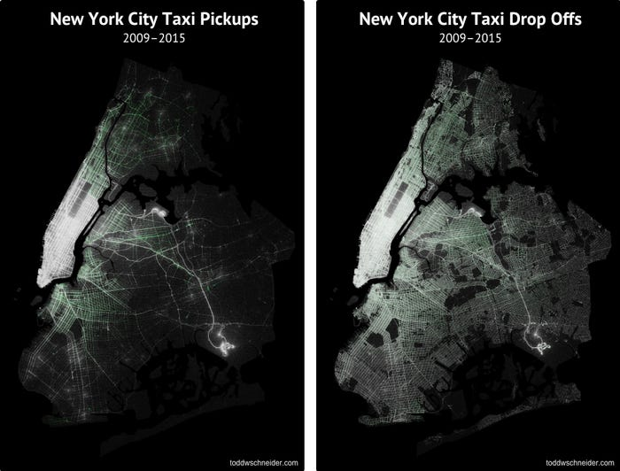

# STA 523 :: Homework 6

Todd Schneider maintains a [GitHub repository](https://github.com/toddwschneider/nyc-taxi-data) 
with scripts and tools for downloading data on more than 1.3 billion taxi and
Uber trips originating in New York City. He is also the one that created the
above images. The data, in CSV format, is also available on the NYC Taxi & 
Limousine Commission 
[website](https://www1.nyc.gov/site/tlc/about/tlc-trip-record-data.page).

For this assignment, choose at least one month of data that contains
location data for both the yellow and green taxi trips. Most months before July
2016 should have this information. As a reminder, we don't have a real Spark
cluster, so do not try to use all 1.3 billion records.

As you work on the tasks that follow, you may do so locally or on Rook; 
however, do no use more than 4 cores for your local Spark cluster. To stay 
organized, make use of script files and only bring your final images into the 
Rmd file. Also, do not try and push the data to GitHub, it is too large.
Despite this, your work must still be reproducible. There should be code that
downloads the data you are working with.

## Tasks

#### Task 1 - Pick-up and drop-off heatmaps

Create four quasi-heatmaps based on the taxi record location data. Two heatmaps
should be based on the pick-up locations (one for yellow and one for green
pick-ups), and the other two heatmaps should be based on the drop-off locations 
(one for yellow and one for green drop-offs). Use Spark as much as possible to 
do your wrangling and aggregation. Only return to R what you plan to plot. Keep 
the Spark workflow mentioned in lecture in mind. The quasi-heatmaps can be 
created by rounding the coordinates, getting counts for each bucket, plotting
the points, and adjusting the plot's aesthetics.

Your construction of the quasi-heatmaps will be an iterative process that 
consists of the following.

- Adjusting the rounding precision to obtain more or less aggregated locations.
- Setting the transparency (alpha) based on the counts associated with
  the aggregated location counts. Recall that alpha is between 0 and 1. Your
  mapping of counts to alpha need not be linear.
- Adjusting the plot point character and its size.
- Possibly trying base R graphics functions, `ggplot()`, or other 
  visualization libraries.

Once you have settled on all the parameters of your heatmaps, briefly comment
on what you observe. Are there any trends, similarities, or differences
between the cab companies and pick-up / drop-off locations?

#### Task 2 - Analyzing rush hours

Building off Task 1, incorporate information about rush hours in your pick-up
heatmaps. Define rush hour as the pick-ups that took place from 7am - 10am and
4pm - 7pm. Use the color aesthetic to depict this new variable (rush hour
versus non-rush hour). Only return to R what you plan to plot. Keep the Spark
workflow mentioned in lecture in mind.

Once you have settled on all the parameters of your heatmaps, briefly comment
on what you observe. Are there any trends, similarities, or differences
between the cab companies and pick-up locations in rush hour versus non-rush 
hour?

#### Task 3 - Sharing

Share at least one of your final quasi-heatmaps
(if you faceted and have one image that is okay) from Task 1 in our #hw6 Slack
channel.

## Essential details

### Deadline and submission

**The deadline to submit Homework 6 is Monday, November 16 at 11:59pm ET.**
Only your final commit and code in the master branch will be graded.
To submit, push your work to your assigned team repository on GitHub before
the deadline.

### Help

- Post your questions in the #hw6 channel on Slack. Explain your error / problem
  in as much detail as possible or give a reproducible example that generates
  the same error. Make use of the code snippet option available in Slack. You
  may also send a direct message to the instructor or TAs.

- Visit the instructor or TAs in Zoom office hours.

- The instructor and TAs will not answer any questions about this assignment
 	within six hours of the deadline.

### Academic integrity

This is a team assignment. You may **not** communicate with other teams in the
course. As a reminder, any code you use directly or as inspiration must be
cited.

To uphold the Duke Community Standard:

- I will not lie, cheat, or steal in my academic endeavors;
- I will conduct myself honorably in all my endeavors; and
- I will act if the Standard is compromised.

Duke University is a community dedicated to scholarship, leadership, and
service and to the principles of honesty, fairness, respect, and accountability.
Citizens of this community commit to reflect upon and uphold these principles in
all academic and non-academic endeavors, and to protect and promote a culture of
integrity. Cheating on exams and quizzes, plagiarism on homework assignments and
projects, lying about an illness or absence and other forms of academic
dishonesty are a breach of trust with classmates and faculty, violate the Duke
Community Standard, and will not be tolerated. Such incidences will result in a
0 grade for all parties involved as well as being reported to the University
Judicial Board. Additionally, there may be penalties to your final class grade.
Please review Duke’s Standards of Conduct.

### Grading

| **Topic**                           | **Points** |
|-------------------------------------|-----------:|
| Task 1                              |         18 |
| Task 2                              |         10 |
| Task 3                              |          2 |
| **Total**                           |     **30** |

*A portion of the points for Tasks 1 and 2 will be allocated to code style.*

*Documents that fail to knit after minimal intervention will receive a 0*.
